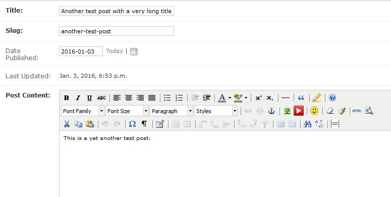

Usage
=====

Publishing Posts
----------------

After deploying the site login to the admin panel and start writing your posts in **Posts** section.
Optionally you can create categories to assign to your posts.

Posts and Pages are created and edited using a rich text WYSIWYG editor (TinyMCE 4).

    **Writing a post**

Embedding Youtube videos and programming code syntax highlighting are supported.

.. note:: In editor's preview window code is shown without highlighting.

To publish a post check **Published** box.
Authorized users can view unpublished posts on the site by clicking "**View on site >**" button.
Unauthorized users will get ``404`` page if they try to open unpublished posts.

Posts marked as "Featured" also appear in their own section in the site navigation menu.

Adding Pages
------------

To create a "plain" page first you need to create the page itself.
A page is similar to a post but it does not have extended attributes like "Date publieshed", etc.
Then create a **Menu Link**: enter a caption, a slug (by default auto-populated from the caption)
and select a page to be shown under that link.

Menu Links that have attached pages are displayed in the order they have been created.
To re-arrange pages you need to edit Menu Links and re-attach pages.
This may be not very convenient, but usually you don't need to reorganize site's pages
very often.
